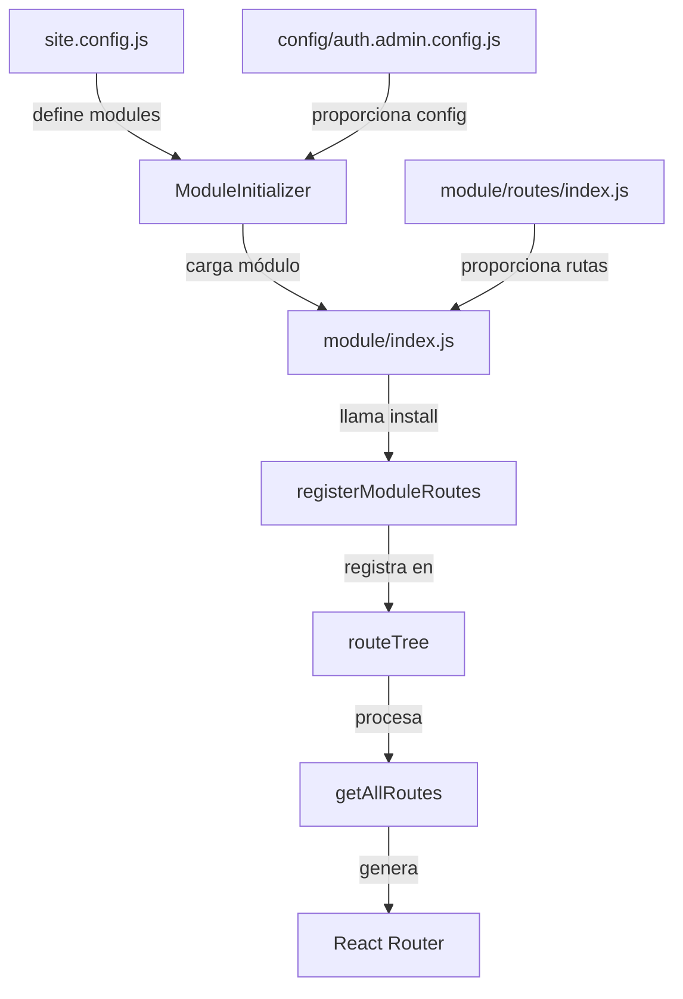

# Sistema de Rutas Dinámicas - Compatibilidad con Nueva Arquitectura

## 📋 Resumen

El sistema de rutas dinámicas **se mantiene completamente funcional** con la nueva arquitectura modular. Las rutas siguen el patrón:

```
/{siteName}/{moduleName}/{path}
```

### Ejemplos:
- `/zoomy/auth/login` - Login en el site Zoomy
- `/zoomy/admin/auth` - Admin de auth en Zoomy
- `/blocave/auth/register` - Registro en Blocave
- `/zoomy/admin/project/create` - Crear proyecto en admin de Zoomy

---

## 🔄 Compatibilidad con Múltiples Instancias

### Sistema Anterior (1 instancia por módulo)
```
/zoomy/auth/login       → Una sola instancia de Auth
/zoomy/admin/auth       → Admin gestiona Auth
```

### Sistema Nuevo (Múltiples instancias)
```javascript
// En site.config.js
modules: [
  { instanceId: 'auth-admin', name: 'auth', scope: 'admin' },
  { instanceId: 'auth-panel', name: 'auth', scope: 'panel' },
  { instanceId: 'auth-compras', name: 'auth', scope: 'compras' }
]
```

### Rutas generadas automáticamente:

#### Opción 1: Rutas por Scope (Recomendado)
```
/zoomy/admin/auth/login          → auth-admin instance
/zoomy/panel/auth/login          → auth-panel instance
/zoomy/compras/auth/login        → auth-compras instance
```

#### Opción 2: Rutas por instanceId
```
/zoomy/auth-admin/login          → auth-admin instance
/zoomy/auth-panel/login          → auth-panel instance
/zoomy/auth-compras/login        → auth-compras instance
```

---

## 🏗️ Arquitectura del Sistema de Rutas

### 1. Registro en Site index.js

```javascript
// src/sites/zoomy/index.js
import { registerSiteRoutes } from '../../zoom/routing/routesRegistry';
import { routes } from './routes/index';
import siteConfig from './site.config';

export default {
  name: "zoomy",
  config: siteConfig,
  modules: ['auth', 'admin', 'account', 'compras'],
  
  install: () => {
    // Registrar rutas base del site
    registerSiteRoutes("zoomy", routes);
  }
};
```

### 2. Registro en Module index.js

```javascript
// src/modules/auth/index.js
import { registerModuleRoutes } from '../../zoom/routing/routesRegistry';
import { routes, defaultLayoutConfig } from './routes';

export default {
  name: "auth",
  dependencies: [],
  defaultLayouts: defaultLayoutConfig,
  
  install(siteName, parentModule = null, inheritedLayouts = {}) {
    console.log(`🔐 Registrando módulo Auth en ${siteName}`);
    
    // Registrar rutas del módulo
    registerModuleRoutes("auth", routes, siteName, parentModule, inheritedLayouts);
  }
};
```

### 3. Definición de Rutas del Módulo

```javascript
// src/modules/auth/routes/index.js
export const routes = [
  {
    path: "",
    moduleName: "auth",
    layout: "modules/auth/layouts/AuthLayout.jsx",
    children: [
      {
        path: "login",
        componentPath: "modules/auth/pages/Login.jsx"
      },
      {
        path: "register",
        componentPath: "modules/auth/pages/Register.jsx"
      },
      {
        path: "forgot-password",
        componentPath: "modules/auth/pages/ForgotPassword.jsx"
      }
    ]
  }
];
```

---

## 🔗 Integración con ModuleInitializer

El `ModuleInitializer` respeta y mejora el sistema de rutas existente:

### Proceso de Inicialización

```javascript
// 1. ModuleInitializer carga el site.config.js
const siteConfig = {
  siteId: 'zoomy',
  modules: [
    { 
      instanceId: 'auth-admin',
      name: 'auth',
      scope: 'admin',
      routePrefix: 'admin/auth', // ← Define el prefijo de ruta
      config: './config/auth.admin.config.js'
    },
    { 
      instanceId: 'auth-panel',
      name: 'auth',
      scope: 'panel',
      routePrefix: 'panel/auth', // ← Define el prefijo de ruta
      config: './config/auth.panel.config.js'
    }
  ]
};

// 2. Carga cada instancia de módulo
const authAdmin = await loadModuleCode('auth', '1.0.0');
const authPanel = await loadModuleCode('auth', '1.0.0');

// 3. Instala cada instancia con su configuración específica
authAdmin.install('zoomy', 'admin', { /* layouts */ });
authPanel.install('zoomy', 'panel', { /* layouts */ });

// 4. Las rutas se registran automáticamente en routesRegistry
```

### Resultado Final

```javascript
// routeTree después de la inicialización
{
  zoomy: {
    base: [...],
    modules: {
      admin: {
        routes: [...],
        submodules: {
          auth: {  // ← auth-admin instance
            routes: [
              { path: '/zoomy/admin/auth/login', ... },
              { path: '/zoomy/admin/auth/config', ... }
            ]
          }
        }
      },
      panel: {
        routes: [...],
        submodules: {
          auth: {  // ← auth-panel instance
            routes: [
              { path: '/zoomy/panel/auth/login', ... },
              { path: '/zoomy/panel/auth/register', ... }
            ]
          }
        }
      }
    }
  }
}
```

---

## 🎯 Configuración en site.config.js

### Definir Rutas para Instancias Múltiples

```javascript
// src/sites/zoomy/site.config.js
export default {
  siteId: 'zoomy',
  
  modules: [
    {
      instanceId: 'auth-admin',
      name: 'auth',
      version: '1.0.0',
      scope: 'admin',
      
      // IMPORTANTE: Define cómo se registran las rutas
      routing: {
        // Opción 1: Como submódulo de admin
        parentModule: 'admin',
        routePrefix: 'auth',  // → /zoomy/admin/auth/*
        
        // Opción 2: Como módulo raíz con prefijo
        // parentModule: null,
        // routePrefix: 'admin-auth', // → /zoomy/admin-auth/*
      },
      
      config: './config/auth.admin.config.js',
      lazy: false,
      priority: 1
    },
    
    {
      instanceId: 'auth-panel',
      name: 'auth',
      version: '1.0.0',
      scope: 'panel',
      
      routing: {
        parentModule: 'panel',
        routePrefix: 'auth'  // → /zoomy/panel/auth/*
      },
      
      config: './config/auth.panel.config.js',
      lazy: false,
      priority: 1
    },
    
    {
      instanceId: 'auth-compras',
      name: 'auth',
      version: '1.0.0',
      scope: 'compras',
      
      routing: {
        parentModule: 'compras',
        routePrefix: 'auth'  // → /zoomy/compras/auth/*
      },
      
      config: './config/auth.compras.config.js',
      lazy: true,
      lazyTrigger: 'manual'
    }
  ]
};
```

---

## 🔧 Implementación en ModuleInitializer

Actualización necesaria en `ModuleInitializer.js` para usar la configuración de routing:

```javascript
async initializeModule(instanceId) {
  const moduleConfig = this.getModuleConfig(instanceId);
  
  // ...código de inicialización...
  
  // Registrar rutas usando la configuración de routing
  if (moduleConfig.routing) {
    const { parentModule, routePrefix } = moduleConfig.routing;
    
    // Llamar al install del módulo con los parámetros correctos
    await instance.install(
      this.siteId,           // siteName
      parentModule,           // parentModule (ej: 'admin', 'panel')
      finalConfig.layouts     // inheritedLayouts
    );
    
    console.log(`[ModuleInitializer] Rutas registradas: /${this.siteId}/${parentModule || ''}/${routePrefix || ''}`);
  }
}
```

---

## 📊 Flujo Completo de Registro de Rutas



---

## 🎨 Layouts y Herencia

El sistema de layouts también se mantiene compatible:

### Jerarquía de Layouts

```
1. Layout por defecto del módulo (modules/auth/layouts/AuthLayout.jsx)
2. Layout heredado del parent (admin puede sobreescribir)
3. Layout específico de la ruta (modules/auth/layouts/MinimalLayout.jsx)
```

### Ejemplo con Múltiples Instancias

```javascript
// auth-admin usa layout de Admin
{
  instanceId: 'auth-admin',
  routing: {
    parentModule: 'admin',
    inheritLayouts: {
      auth: 'modules/admin/layouts/MainLayout.jsx'  // ← Sobreescribe layout de Auth
    }
  }
}

// auth-panel usa su propio layout
{
  instanceId: 'auth-panel',
  routing: {
    parentModule: 'panel',
    inheritLayouts: {}  // ← Usa layout por defecto de Auth
  }
}
```

**Resultado:**
- `/zoomy/admin/auth/login` → Usa `MainLayout.jsx` de Admin
- `/zoomy/panel/auth/login` → Usa `AuthLayout.jsx` de Auth

---

## 🔐 Relación con Auth

Las configuraciones en `config/` definen el comportamiento de cada instancia:

### auth.admin.config.js
```javascript
export default {
  // Configuración de autenticación para administradores
  providers: ['ldap'],
  mfa: { enabled: true },
  session: {
    timeout: 3600,
    renewable: false,
    storage: 'memory'
  },
  
  // Permisos y roles específicos de admin
  permissions: {
    canManageUsers: true,
    canViewAuditLog: true
  }
};
```

### auth.panel.config.js
```javascript
export default {
  // Configuración de autenticación para usuarios del panel
  providers: ['google', 'facebook', 'credentials'],
  registration: { enabled: true, autoActivate: false },
  session: {
    timeout: 7200,
    renewable: true,
    storage: 'localStorage'
  },
  
  // Permisos de usuario regular
  permissions: {
    canManageUsers: false
  }
};
```

---

## ✅ Checklist de Migración

Para migrar un site existente al nuevo sistema:

- [ ] **1. Crear `site.config.js`** con definición de todas las instancias de módulos
- [ ] **2. Agregar `routing` config** a cada instancia de módulo
- [ ] **3. Actualizar `sites/{site}/index.js`** para usar `ModuleInitializer`
- [ ] **4. Mantener** `registerSiteRoutes` y `registerModuleRoutes` existentes
- [ ] **5. No modificar** los `routes/index.js` de cada módulo
- [ ] **6. Configurar** `parentModule` para definir jerarquía de rutas
- [ ] **7. Definir** `routePrefix` si se necesita prefijo personalizado
- [ ] **8. Verificar** que las rutas se generen correctamente con `debugRouteTree()`

---

## 🚀 Ventajas del Nuevo Sistema

### 1. Múltiples Instancias con Rutas Separadas
```javascript
// Antes: Una sola instancia
/zoomy/auth/login → Una configuración de Auth para todo

// Ahora: Múltiples instancias
/zoomy/admin/auth/login   → Config estricta para admins
/zoomy/panel/auth/login   → Config flexible para usuarios
/zoomy/compras/auth/login → Config heredada de panel
```

### 2. Configuración Declarativa
```javascript
// Todo en un solo lugar (site.config.js)
modules: [
  { instanceId: 'auth-admin', routing: { parentModule: 'admin' } },
  { instanceId: 'auth-panel', routing: { parentModule: 'panel' } }
]
```

### 3. Lazy Loading por Instancia
```javascript
// Admin y Panel críticos, Compras lazy
{ instanceId: 'auth-admin', lazy: false },
{ instanceId: 'auth-panel', lazy: false },
{ instanceId: 'auth-compras', lazy: true }
```

### 4. Sesiones Aisladas
```javascript
// Cada instancia puede tener su propia sesión
instanceRules: {
  auth: {
    sessions: {
      admin: { isolated: true, timeout: 3600 },
      panel: { isolated: false, canShare: ['compras'] }
    }
  }
}
```

---

## 🎯 Conclusión

El nuevo sistema de arquitectura modular:

✅ **Mantiene** el sistema de rutas dinámicas existente  
✅ **Respeta** la estructura `/{site}/{module}/{path}`  
✅ **Mejora** permitiendo múltiples instancias por módulo  
✅ **Preserva** la compatibilidad con `registerModuleRoutes`  
✅ **Añade** configuración declarativa de routing  
✅ **Permite** jerarquías complejas de módulos/submódulos  

**No se rompe ninguna funcionalidad existente**, solo se extiende para soportar casos de uso más avanzados.
