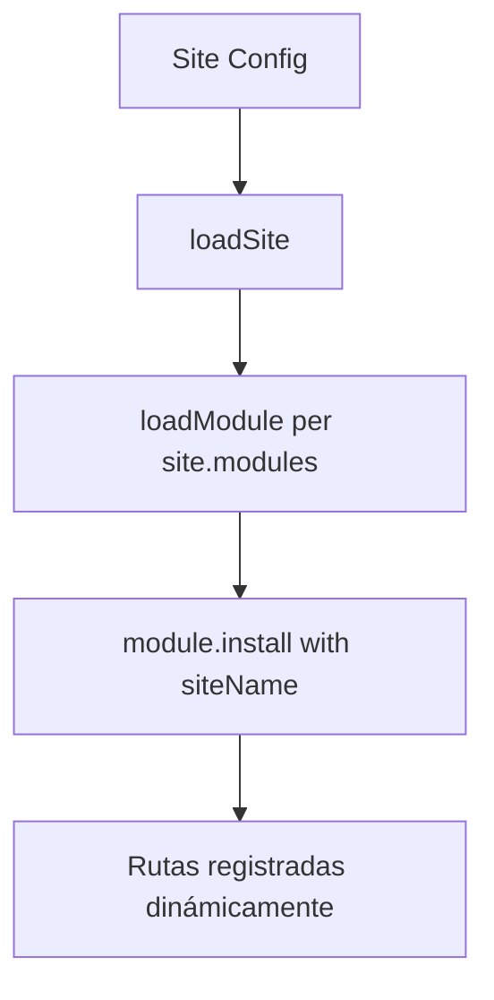

# Arquitectura Modular Corregida - Principios de Diseño

## ❌ Errores Anteriores Identificados

### 1. Referencias Estáticas en Auth Module
**Problema**: `siteName = "zoomy"` hardcodeado
**Solución**: `siteName` requerido como parámetro

### 2. Sobreescritura Incorrecta en Admin
**Problema**: Admin sobreescribía ALL auth layouts (incluyendo rutas públicas)
**Solución**: Comentado hasta implementar CRUD específico

## ✅ Arquitectura Correcta

### 1. Filosofía Modular Pura
```javascript
// ❌ MAL - Referencias estáticas
install(siteName = "zoomy", parentModule = null) {
  // Rompe la filosofía modular
}

// ✅ BIEN - Completamente dinámico  
install(siteName, parentModule = null, inheritedLayouts = {}) {
  if (!siteName) {
    throw new Error("Auth module: siteName es requerido");
  }
  // Módulo puede instalarse en cualquier sitio
}
```

### 2. Separación de Responsabilidades

```javascript
// Admin Module - Solo para operaciones CRUD/administrativas
layouts: {
  // NOTA: Solo para rutas administrativas de auth, no rutas públicas
  // auth: "modules/admin/layouts/MainLayout.jsx", // COMENTADO hasta CRUD
  project: "modules/admin/layouts/MainLayout.jsx",
  newsletter: "modules/admin/layouts/MainLayout.jsx", 
  marketing: "modules/admin/layouts/MainLayout.jsx",
}
```

### 3. Flujo Correcto de Instalación



## 🎯 Casos de Uso

### 1. Auth en Sitio "Zoomy" 
```javascript
// sites/zoomy/index.js
modules: ['auth', 'marketing']

// Result: auth.install('zoomy', null, {})
// Auth usa sus propios layouts por defecto
```

### 2. Auth en Sitio "Corporate"
```javascript  
// sites/corporate/index.js
modules: ['auth', 'admin']

// Result: auth.install('corporate', null, {})
// Auth funciona igual, completamente portable
```

### 3. Auth bajo Admin (futuro CRUD)
```javascript
// modules/admin/index.js 
modules: ['auth', 'project'] 
layouts: {
  auth: "modules/admin/layouts/MainLayout.jsx" // Solo CRUD
}

// Result: auth.install('zoomy', 'admin', {auth: 'MainLayout'})
// Solo rutas CRUD tendrían layout de admin
```

## 🔧 Próximos Pasos

1. **Separar rutas públicas vs CRUD en auth**
   - `routes/public.js` - Login, register, etc.
   - `routes/admin.js` - CRUD de usuarios

2. **Implementar layouts condicionalmente**
   - Rutas públicas: Siempre usan layout propio
   - Rutas admin: Pueden ser sobreescritas por parent

3. **Testing multi-sitio**
   - Verificar auth funciona en cualquier site
   - Sin referencias hardcodeadas

## ✅ Validación

- [x] Auth module sin referencias estáticas a sitios
- [x] Admin no sobreescribe layouts públicos de auth  
- [x] Sistema completamente modular y portable
- [x] Validación de parámetros requeridos
- [ ] Separación rutas públicas vs admin en auth
- [ ] Testing en múltiples sitios
